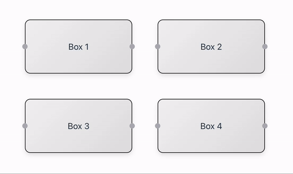

# react-node-linker

## Description

`react-node-linker` is a React library that allows you to link items in a React application by automatically placing circles between each item. Users can also drag and drop to link the items.



## Installation

You can install this library via npm:

```bash
npm install react-node-linker
```

## Usage

Here is an example of how you can use `react-node-linker` in your React application:

```javascript
import { ConnectionContainer, Box, Connection, Point } from "react-node-linker";
import { useCallback, useState } from "react";

function App() {
  const [connections, setConnections] = useState<Connection[]>([]);
  const onConnectionAdded = (fromId: string, toId: string) => {
    setConnections([
      ...connections,
      {
        from: { id: fromId, position: "right" },
        to: { id: toId, position: "left" },
      },
    ]);
  };

  const handleLinkClick = useCallback(
    (fromId: string, toId: string) => {
      setConnections((prevConnections) =>
        prevConnections.filter(
          (connection) =>
            connection.from.id !== fromId &&
            (connection.to as Point).id !== toId
        )
      );
    },
    [setConnections]
  );

  console.log(connections);
  return (
    <div
      style={{
        margin: "3rem",
        display: "flex",
        gap: "2rem",
        width: "100%",
        height: "100%",
      }}
    >
      <ConnectionContainer
        connections={connections}
        onConnectionAdded={onConnectionAdded}
        onClickLink={handleLinkClick}
      >
        <div
          style={{
            display: "flex",
            flexDirection: "column",
            gap: "3rem",
            padding: "2rem",
          }}
        >
          <div style={{ display: "flex", gap: "3rem" }}>
            <div>
              <Box id="box1">
                <div style={boxStyle}>Box 1</div>
              </Box>
            </div>

            <Box id="box2">
              <div style={boxStyle}>Box 2</div>
            </Box>
          </div>
          <div style={{ display: "flex", gap: "3rem" }}>
            <Box id="box3">
              <div style={boxStyle}>Box 3</div>
            </Box>
            <Box id="box4">
              <div style={boxStyle}>Box 4</div>
            </Box>
          </div>
        </div>
      </ConnectionContainer>
    </div>
  );
}

const boxStyle = {
  width: "200px",
  height: "100px",
  border: "1px solid black",
  borderRadius: "10px",
  boxShadow: "0 4px 8px rgba(0, 0, 0, 0.1)",
  background: "linear-gradient(135deg, #f3f3f3, #e2e2e2)",
  display: "flex",
  alignItems: "center",
  justifyContent: "center",
};

export default App;

```

## API

### `ConnectionContainer`

A container component that manages the linking of items. Wrap your items with this component.

#### Props

- None

### `Box`

A component representing an item that can be linked. Each `Box` should have a unique `id`.

#### Props

- `id` (string): A unique identifier for the box.

## Contributing

If you would like to contribute to this library, please feel free to submit a pull request or open an issue on GitHub.
